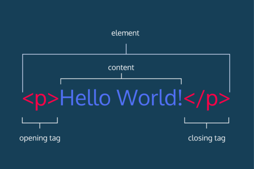
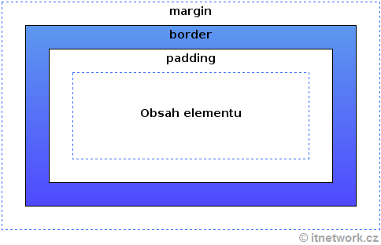

# Poznámky


## Tag vs. element


```html
<p>První odstavec</p>
```

## Vložení obrázku
```html


```

## Napojení CSS stylu na stránku
- vytvořím styl.css a v něm popíšeme styly.

```html
<head>
    <meta charset="utf-8" />
    <link rel="stylesheet" href="styl.css" type="text/css" />
```

- styl se pak tvoří následně

```css
h1, h2 {
    text-align: center;
}
```

## Box model
-  padding je vnitřní odsazení, margin to vnější.


- může být obecně
```css
padding: 20px;
margin: 20px;
```
- nebo specificky
```ccs
padding-top: 20px;
padding-right: 20px;
padding-bottom: 20px;
padding-left: 20px;

margin-top: 20px;
margin-right: 20px;
margin-bottom: 20px;
margin-left: 20px;
```

## CSS generatory
Odkaz: [Animista](https://animista.net)